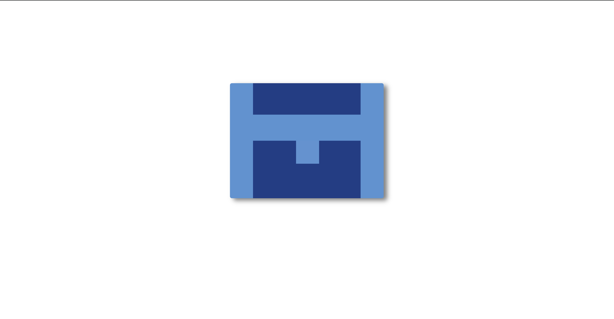

<h1>Blue T Shape Challenge</h1>

The Blue T Shape challenge involves creating a simple blue T-shaped design using HTML and CSS. This challenge is a part of the CSS Battle series, designed to improve your CSS skills through practical examples.

<h2>Table of Contents</h2>
<ul>
    <li><a href="#introduction">Introduction</a></li>
    <li><a href="#purpose">Purpose</a></li>
    <li><a href="#prerequisites">Prerequisites</a></li>
    <li><a href="#file-structure">File Structure</a></li>
    <li><a href="#tools">Tools</a></li>
    <li><a href="#preview">Preview</a></li>
    <li><a href="#credits">Credits</a></li>
</ul>

<h2 id="introduction">Introduction</h2>

The Blue T Shape challenge involves creating a simple blue T-shaped design using HTML and CSS. This challenge is a part of the CSS Battle series, designed to improve your CSS skills through practical examples.

<h2 id="purpose">Purpose</h2>

The purpose of this challenge is to practice and enhance your CSS layout skills, particularly in positioning elements using relative and absolute positioning, as well as understanding box-model properties such as margin, padding, and box-shadow.

<h2 id="prerequisites">Prerequisites</h2>
<ul>
    <li>HTML structure</li>
    <li>CSS fundamentals (selectors, properties, etc.)</li>
</ul>

<h2 id="file-structure">File Structure</h2>

The project consists of the following files:

<pre>
Blue-T-Shape/
│
├── index.html
└── styles.css
</pre>

<h2 id="tools">Tools</h2>
<ul>
    <li>A code editor (e.g., VSCode)</li>
    <li>A web browser for viewing the demo</li>
</ul>

<h2 id="preview">Preview</h2>

You can view the live demo of the challenge <a href="https://codepen.io/Yashi-the-lessful/pen/MWdNwYZ">here</a>.

<h2 id="credits">Credits</h2>

This challenge is inspired by a target of the day on <a href="https://cssbattle.dev/play/YbA1ojJfvlDWu2kCqRTG">CSS Battle</a>.

